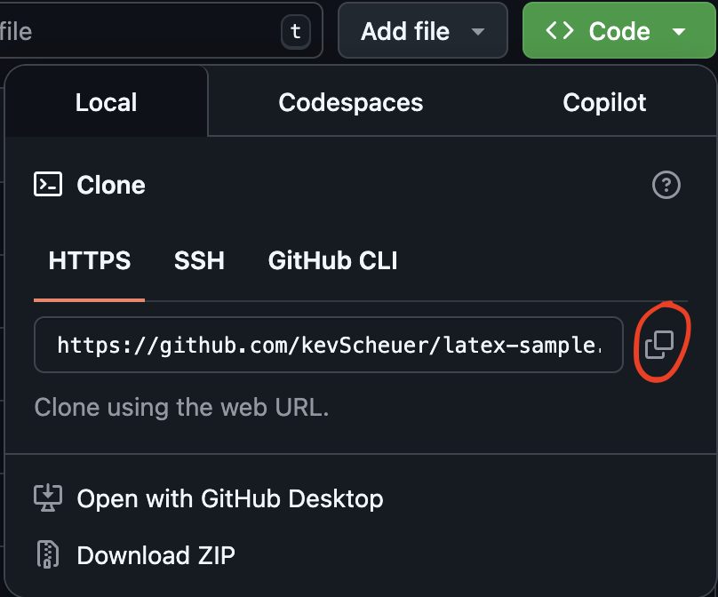

# Welcome! :wave:
This project is a simple $\LaTeX$ project for new users to test out as part of my [*Streamline Scientific Writing with VS Code + Zotero + Github* blog post](https://kevscheuer.github.io/LaTeX-for-VScode/). The instructions for this repo assume you already have a working install of TeX Live and VS Code on your machine. By downloading this sample project you'll have a template for working with git and Zotero in VS Code.

## Instructions :memo:
1. Near the top of the page click the **`<> Code`** button
2. Copy the https url (see screenshot below)

3. Open VS Code and in the primary side bar select the **Source Control** tab. Choose **Clone Repository** and paste the url in the popup window, then select where you would like this sample repo to be stored on your machine.
4. Open the repo in a VS Code window. The **Source Control** should now show a greyed-out commit option for when you'll be making changes.
5. :tada: You're all set! :tada: Return to [the blog tutorial](https://kevscheuer.github.io/LaTeX-for-VScode/) to continue the setup.